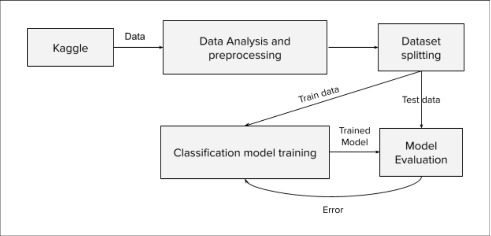

# IEEE-CIS Fraud Detection

### Goal

The goal here is to perform classification task for the [Kaggle competition](https://www.kaggle.com/c/ieee-fraud-detection) that will work as fruad prevention system for customers and will save millions of dollars per year. The main focus of this project is to improve the accuracy of the model(i.e. Model that can more accurately detect the fraud) using a non-traditional method called Stein Variational Neural Networks Ensemble.

Stein Variational Neural Networks Ensemble can be viewed as an approximate way of performing Bayesian inference in neural networks. The main idea behind this is to bridge the gap between Deep Ensembles and BNN(Bayesian Neural Networks) and to overcome the limitations of these two separate methods as Ensembles do not offer a proper Bayesian justification and do not provide guarantee for the diversity, leading to redundant solutions in function space.

### Architecture and Approach



<ins>Kaggle:</ins> will provide the dataset

<ins>Data Analysis and preprocessing:</ins> Data Analysis used to extract the distribution of the data and preprocessing transforms the data into appropriate format and distribution which will ease the learning task for the machine. Therefore, before moving towards the classification model design and training, we perform analysis and preprocessing tasks on the given dataset. Preprocessing includes the steps like Missing value management(i.e. Remove the missing values from the dataset), standardization that will change the data distribution, outlier removal, etc.

<ins>Dataset splitting:</ins> Splitter will split the data which will be used for local validation of the trained model. As an artifact, the splitter will divide the data into train data and test data. Train data will be used for model training and test data will be used for validation of the model.

<ins>Classification model training:</ins> This phase represents the machine learning model design and training, here the model means the mathematical function that approximately represents the whole data. The function is approximated by fitting on the train data extracted from the Dataset Splitter. As an artifact, this phase generates the model which will be passed for the model evaluation. Possible classification models are:
    - Logistic Regression
    - Decision Tree
    - Random Forest
    - Bayesian Neural Network
     
<ins>Model Evaluation:</ins> Using model artifacts from the above phase, the model evaluator will validate the model on the basis of test data extracted from the dataset splitter. As an artifact, this phase will produce the Error value and pass back to classification model training for better learning of the model. So as mentioned, Classification model training and Model evaluation works in iteration till the model convergence happen for the whole data(i.e. Train and Test).

Every mathematical function consists of parameters(e.g. ax+by+c=0, here for this equation of line, a, b and c work as parameters of the line) similarly as part of the classification model, we will be going to find the mathematical function that fits the data. Initially, we are not aware of the exact function and so the machine needs to generate the function based on the error values. Function generation is done in gradual iteration by interaction where parameters are updated based on the error value and for this project we are going to use Stein Variational Gradient Descent method.

### Requirements

- Python version 3
- Python Libraries:
    - Numpy
    - Pandas
    - Seaborn
    - Matplotlib, bokeh, altrain
    - Sklearn
    - PyTorch
    - Theano
    - scipy

# Getting started

### Dataset Download

- Download IEEE-CIS-Fraud-Detection dataset from [here](https://drive.google.com/file/d/1hCX4vQ-2YN6Q05Jkl2qT1YwfwjSBSHEr/view?usp=sharing) and extract dataset in the currect working directory under `Dataset/` folder 

- You can download preprocessed data as well from [here](https://drive.google.com/file/d/1SpjsvFMgFoHQLEYYZ_mrx8eQcA_bTPUL/view?usp=sharing) and extract it in the current working directory under `preprocessed/` folder

### Run 

- <ins>Option 1:</ins>

    This option will use the preprocessed training and test data from already downloaded preprocessed data. Run the following command from current working directory,

    ```sh
    python3 main.py
    ```

- <ins>Option 2:</ins>
    
    This option will do the following:
        - load the raw data, preprocess it and save in the preprocessed folder
        - use preprocessed data from preprocessed folder and build the bayesian neural network model following Stein Variation Neural Network method
        - predict on the test data
    Run the following command from current working directory,

    ```sh
    python3 main.py Dataset Dataset
    ```